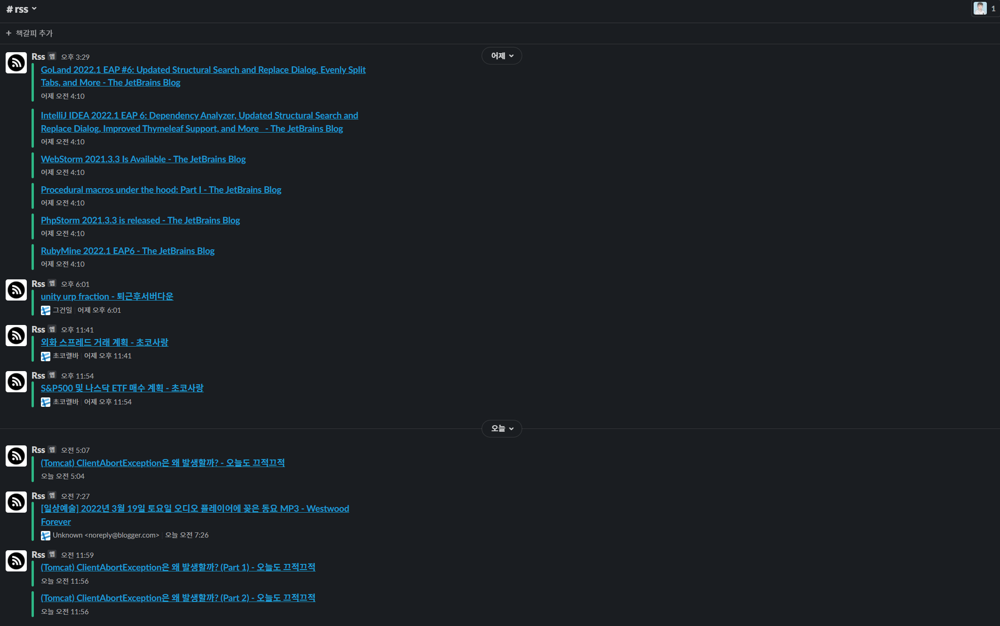

[](https://elky84.github.io)


[](https://github.com/elky84/rss-feed-crawler/actions/workflows/publish_docker.yml)


# rss-feed-crawler

* .NET 6, ASP NET CORE 3를 기반으로 작성되었습니다.
* Feed (RSS) 크롤러로는 [NuGet Gallery | CodeHollow.FeedReader 1.2.1](https://www.nuget.org/packages/CodeHollow.FeedReader/) 사용했습니다.
* 알림은 Discord, Slack을 지원합니다. Notification 데이터를, Source와 매핑 시켜서 해당 Source에 새 데이터가 갱신되면 알림이 날라오게 되어있습니다.
* DB로는 mongoDB를 사용합니다.
* API는 swagger를 통해 확인하셔도 좋지만, http 폴더 안에 예제가 포함되어있습니다.
* 등록된 Rss 소스를 Crawling 해서 알림을 전달합니다.
  * <https://github.com/elky84/rss-feed-crawler/blob/main/Http/rss.http>
    * 위 주소에 제가 사용하는 소스 예시가 있습니다.
* RSS 알림을 Discord나 Slack으로 전달해주는 기능도 작업이 되어있습니다.
	* Feedly Pro 기능에서만 연동이 가능해서, 직접 RSS 크롤링 & Notification 기능을 만들었습니다.

## 각종 API 예시
* VS Code의 RestClient Plugin의 .http 파일용으로 작성
  * <https://marketplace.visualstudio.com/items?itemName=humao.rest-client>
* .http 파일 경로
  * <https://github.com/elky84/rss-feed-crawler/tree/main/Http>
* 해당 경로 아래에 .vscode 폴더에 settings.json.sample을 복사해, settings.json으로 변경하면, VSCode로 해당 기능 오픈시 환경에 맞는 URI로 호출 가능하게 됨
  * <https://github.com/elky84/rss-feed-crawler/blob/main/Http/.vscode/settings.json.sample>
* Swagger로 확인해도 무방함
  * <http://localhost:5000/swagger/index.html>

## Notification.http 예시

```
### VS Code의 RestClient Plugin의 .http 파일용 서식입니다

### Notification Create Multi Discord

POST {{host}}/Notification/Multi
Content-Type: application/json

{
	"Datas": [{
			"Type": "Slack",
			"Name": "RSS",
			"IconUrl": "https://www.bruegel.org/wp-content/uploads/2015/08/icon-rss.png",
			"Channel": "C017WEVV0BS"
			"HookUrl": "",
		}
	]
}
```

## Slack Alarm Sample


